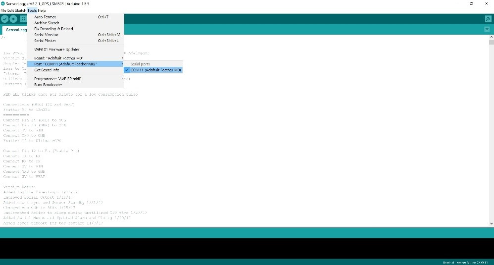
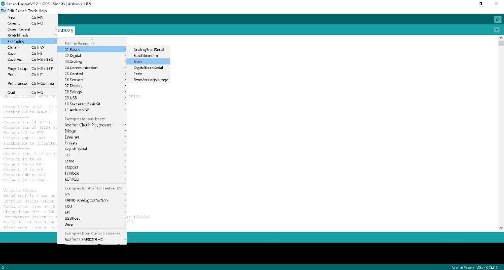
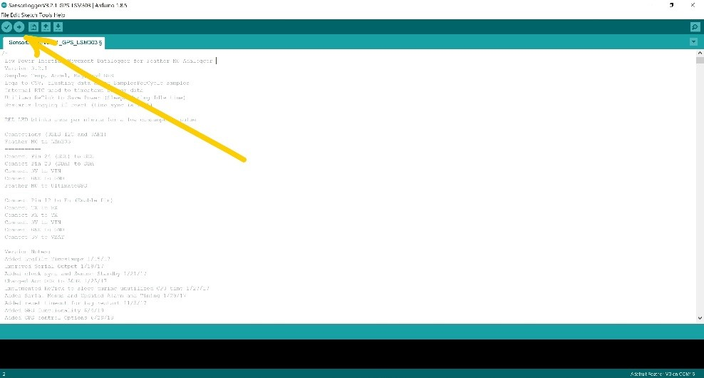
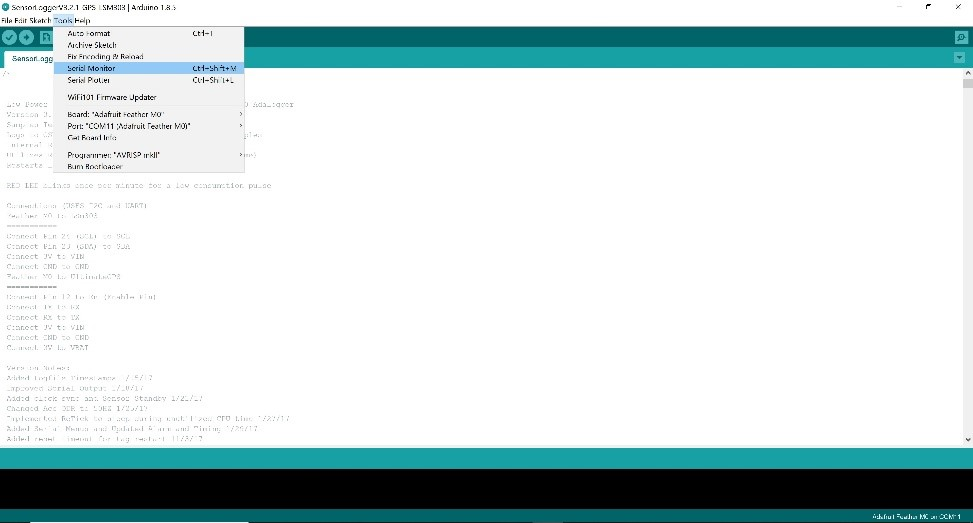
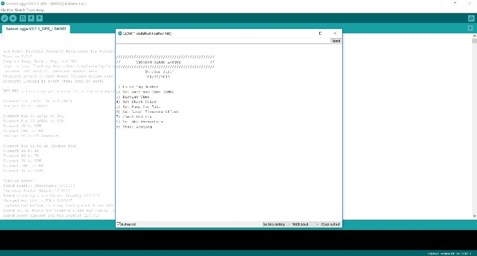

# Fahlbusch and Harrington 2019 

## Supplemental Materials: TWLogger

This document includes:       
A) [Build Instructions and Circuitry Diagram](#A)    
B) [Software and User Interface](#B)

## [A) Build Instructions & Circuitry Diagram](#A)

### Soldering Station Required Equipment

* Soldering iron (Fig. A1)
* Nonconductive table clamps or prefabricated soldering clamp stand (Fig. A2)
* Lead-free solder
* 26-gauge solid core wire
* Wire strippers
* Electrical tape
* Foam paper (e.g., craft supply store)
* Glue (e.g., clear liquid super glue)

{width="4.180247156605424in"
height="2.3513888888888888in"}

{width="4.178240376202974in"
height="2.3502602799650045in"}

### Components List

Purchased from [www.adafruit.com](http://www.adafruit.com) (part \#)

1.  Feather M0 Adalogger (\#2796)

2.  Flora LSM303 (\#1247)

3.  Ultimate GPS Breakout (\#746)

4.  Lithium - 3.7v 500mAh (\#1578)

**[Build Instructions]**:

This is a 4-part process. Prepare each circuit board separately prior to
combining. Wire lengths are given with the corresponding pin name to
which they need to be soldered.

1.  Accelerometer: Flora LSM303- v1.0

    a.  Solder wires to Flora (i.e., pin name: required wire length) (Fig. A3)

        i.  GRD: 3.5cm

        ii. SCL: 6cm

        iii. SDA: 6cm

        iv. 3V: 3cm, 6cm
        
    b.  Cut chafe guard from foam sheet and glue to back of Flora (Fig. A4)  
        
{width="3.209722222222222in"height="3.0944444444444446in"}

{width="2.8527777777777776in"height="3.104861111111111in"}

2.  GPS: Ultimate GPS Breakout -- 66Channel

    a.  Solder wires to GPS (i.e., pin name: required wire length, Fig. A5)

        i.  TX: 3.5cm

        ii. RX: 4.0cm

        iii. GRD: 4.5cm

        iv. EN: 4.5cm
        
        v. VIN: 2.5cm

{width="2.936111111111111in"
            height="4.553472222222222in"}

3.  Connect GPS to Feather M0

    a.  Line up TX, GRD, GRD on the GPS to MO and solder.

    b.  Add small chafe guard to battery area (Fig. A6).

{width="4.571527777777778in"
            height="2.9159722222222224in"}
            
4.  Glue Accelerometer to Feather MO

    a.  Locate the sensor orientation icon on the ACC board and confirm
        it is in line with the text on the Feather M0 (e.g. the "USB"
        text is a good indicator).

    b.  Glue in place.

## B) Software and User Interface {#B}

**[Downloads]**

1.  SD Formatter

> <https://www.sdcard.org/downloads/formatter_4/>

2.  Arduino

> <https://www.arduino.cc/en/main/software>

3.  R Studio

> <https://www.rstudio.com/products/rstudio/download/>

**[SD Formatter]**

1.  Name and format SD card prior to using with TWLogger

**[Arduino]**

1.  Install Arduino software

    a.  Follow setup instructions on Adafruit website:
        <https://learn.adafruit.com/adafruit-feather-m0-adalogger/using-with-arduino-ide>    

2.  Plug TWLogger into computer

    a.  **Confirm battery is plugged into TWLogger and confirm SD card is inserted**    

3.  Open TWLogger Arduino software found on GitHub:<https://github.com/harrington-et-al/TWLogger>

    a.  As of 24 June 2019, version to use is
    SensorLoggerV3.2.1\_GPS\_LSM303

4.  Confirm computer recognizes and can communicate with TWLogger

    a.  Tools -> Port -> [select COM port
        that lists Feather M0 as connected] (Fig. B1)

{width="5.768055555555556in"
        height="3.092361111111111in"} 

5.  Troubleshoot COM port (or skip to step 6). If Feather M0 isn't listed, try two options:

    a. Confirm you properly followed Adafruit setup instructions (step 1 above)

    b. After confirming proper setup, go to File -> Examples -> Basics -> Blink (Fig. B2). Open Blink and click upload (on the
    toolbar below menu options, click the right-hand arrow that is 2^nd^
    icon from left) (Fig. B3).
    
        i. Note: Timing is important in this step. Watch progress report
    (bottom left, orange writing on black area of program screen). After
    it switches from "Compiling Sketch" to "Uploading" quickly double
    click reset button on TWLogger.
    
        ii. Now check if Feather M0 is listed as available on a COM port

{width="5.761111111111111in"
        height="3.0875in"} 

{width="5.788888888888889in"
    height="3.1055555555555556in"}

6.  After correct COM port is selected, press upload (on the toolbar
    below menu options, click the right-hand arrow that is 2^nd^ icon
    from left) to upload TWLogger software.

7.  Immediately after progress bar says
    "Done Uploading" (bottom left, orange writing on black area of
    program screen), go to Tools → Serial Monitor (Fig. B4)

{width="5.651388888888889in"
    height="3.0416666666666665in"}

8.  Complete programming prompts by entering the number into the text
    bar for the parameter you would like to define, then press enter. When
    prompted, enter preferred settings (Table B1; Fig. B5).         

Table B1. User-defined parameters available in the TWLogger setup state.

+-----------------------+-----------------------+-----------------------+
| Settings Prompt       | Parameter Options     | Description           |
+=======================+=======================+=======================+
| Enter Tag Number      | 1-99                  | User enters tag       |
|                       |                       | number which sets     |
|                       |                       | initialization file   |
|                       |                       | name                  |
+-----------------------+-----------------------+-----------------------+
| Set Date and Time     | YYYY-m-d H:M:S        | User syncs the date   |
| (GMT)                 |                       | and time to a GPS     |
+-----------------------+-----------------------+-----------------------+
| Display Time          | \-                    | Displays the clock to |
|                       |                       | confirm sync with     |
|                       |                       | external source       |
+-----------------------+-----------------------+-----------------------+
| Set Sampling Rate     | 5 Hz, 10 Hz, 25 Hz,   | User sets the         |
|                       | 40 Hz, 50 Hz          | sampling rate         |
+-----------------------+-----------------------+-----------------------+
| Set Local Time Zone   | +/- GMT, hour 0-12    | User defines local    |
| Offset                |                       | offset from GMT       |
+-----------------------+-----------------------+-----------------------+
| Check GPS Fix         | \-                    | Displays scrolling    |
|                       |                       | status of GPS fix     |
+-----------------------+-----------------------+-----------------------+
| Set GPS Parameters    | Sampling Rate (s) -   | User selects interval |
|                       | default is 120        | between GPS data      |
|                       | (1-600)               | acquisition           |
|                       |                       |                       |
|                       | Timeout (s) - default | User selects interval |
|                       | is 60 (20-90)         | to wait for a fix     |
|                       |                       | before sleeping       |
|                       | Read Delay (s) -      |                       |
|                       | default is 8 (1-30)   | User selects interval |
|                       |                       | to wait before trying |
|                       | Samples per interval  | to log (allows for a  |
|                       | - default is 1 (1-30) | fix)                  |
|                       |                       |                       |
|                       | Smart Delay (ms) -    | Interval to spend     |
|                       | default is 10 (1-20)  | encoding GPS data     |
|                       |                       | between other         |
|                       |                       | instructions          |
+-----------------------+-----------------------+-----------------------+
| Start Logging         | \-                    | User selects start    |
|                       |                       | logging to initialize |
|                       |                       | the tag               |
+-----------------------+-----------------------+-----------------------+

{width="5.660416666666666in"height="3.0347222222222223in"}

9. Troubleshooting Serial Monitor (or skip to step 9)

    a. If Serial Monitor screen is blank, press spacebar and then press enter. The prompts should appear.

    b. Date: This will default to the date the software was uploaded.

    c. Time: Always program in UTC.

    d. GPS: To check GPS is able to properly establish satellite connections select option 7 in serial monitor.

9.  To begin logging, enter parameter number 9 in the serial monitor text bar and press enter. Logger will begin logging.

10.  Unplug TWLogger. **TWLogger is logging!**

    a.  A red LED pulse will confirm the device is logging properly. The
        microprocessor will blink at top of each minute and the GPS will
        blink at 1-Hz while it is attempting a fix.

    b.  If the microprocessor LED is flashing rapidly, it means there is
        an error. The most likely cause the inability to read or write
        to the SD card.

**[R Studio]**

1.  Documented TWLogger analysis scripts available here:
    
> http://github.com/jamesfahlbusch/TWLogger 

2.  Documentation for tagtools package available here:

> http://www.animaltags.org/doku.php?id=tagwiki:info:people
